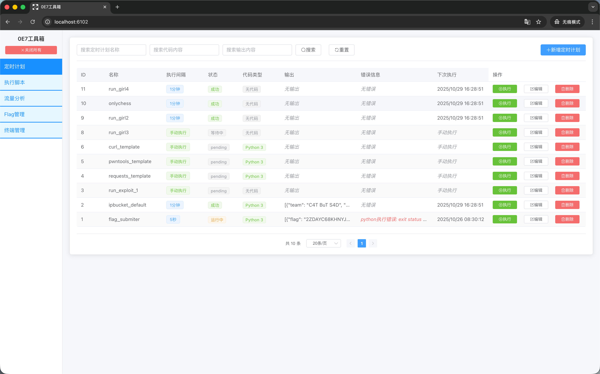
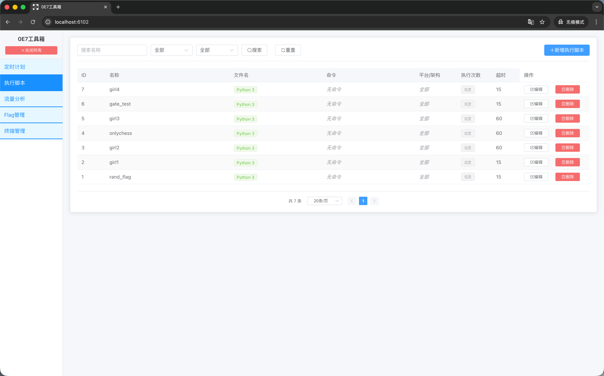
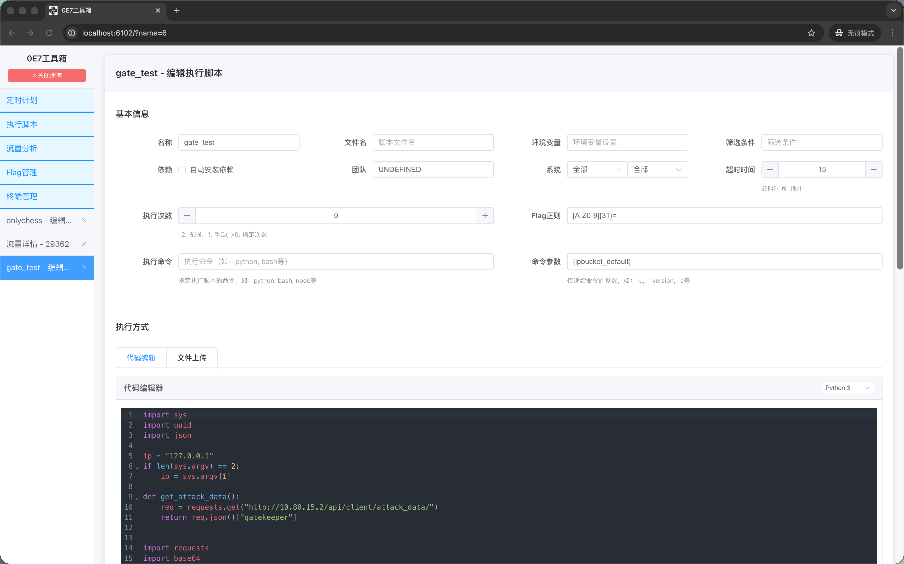
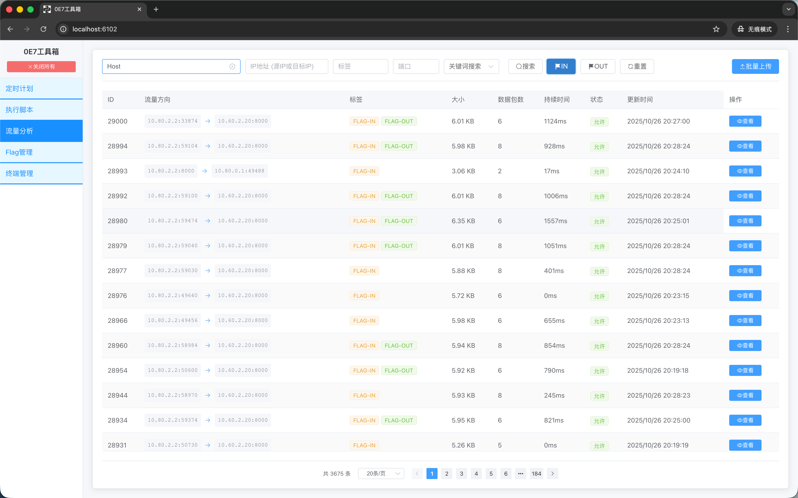
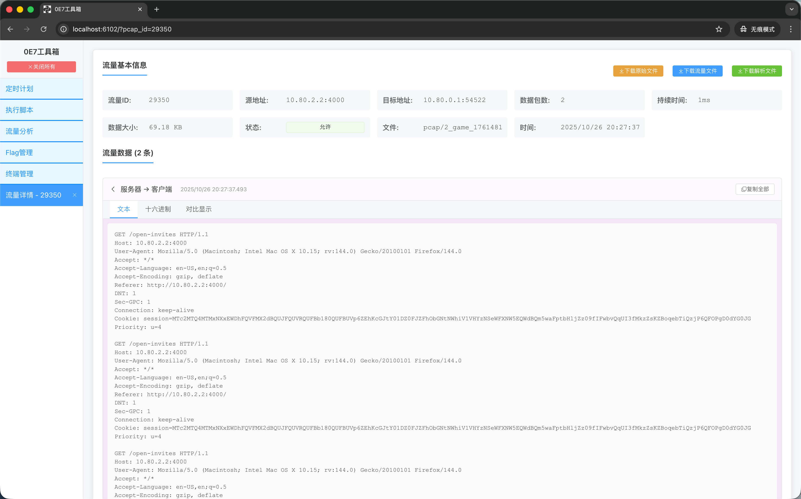
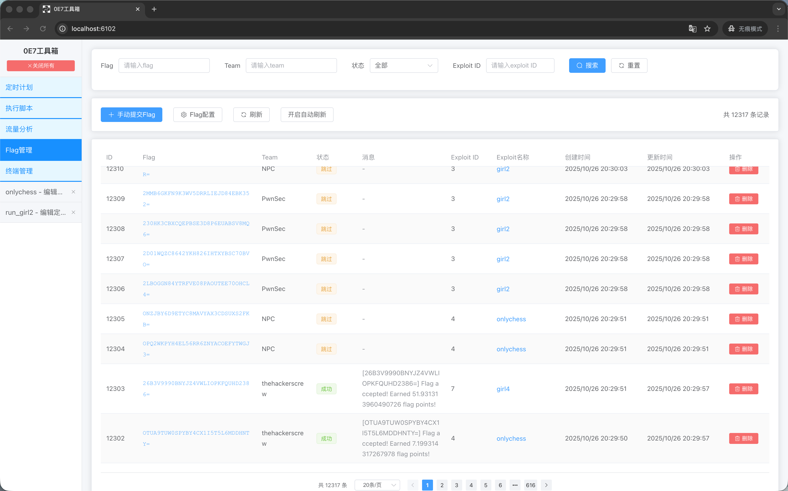

# 平台演示

## 定时计划
定时执行Exploit脚本，Flag提交器等

## Exploit管理
可以查看管理不同的攻击脚本

### 在线编辑

### 实时查看运行结果

## 流量分析

### 流量查询
可以根据Flag透出条件、IP端口、全文关键词模糊匹配（支持多关键词）搜索

### 在线分析流量

可以支持多种在线流量分析方式，自动重组TCP流，解析HTTP中的压缩流量

## Flag管理
查看不同Flag的提交情况，由哪些队伍，哪些脚本产生

